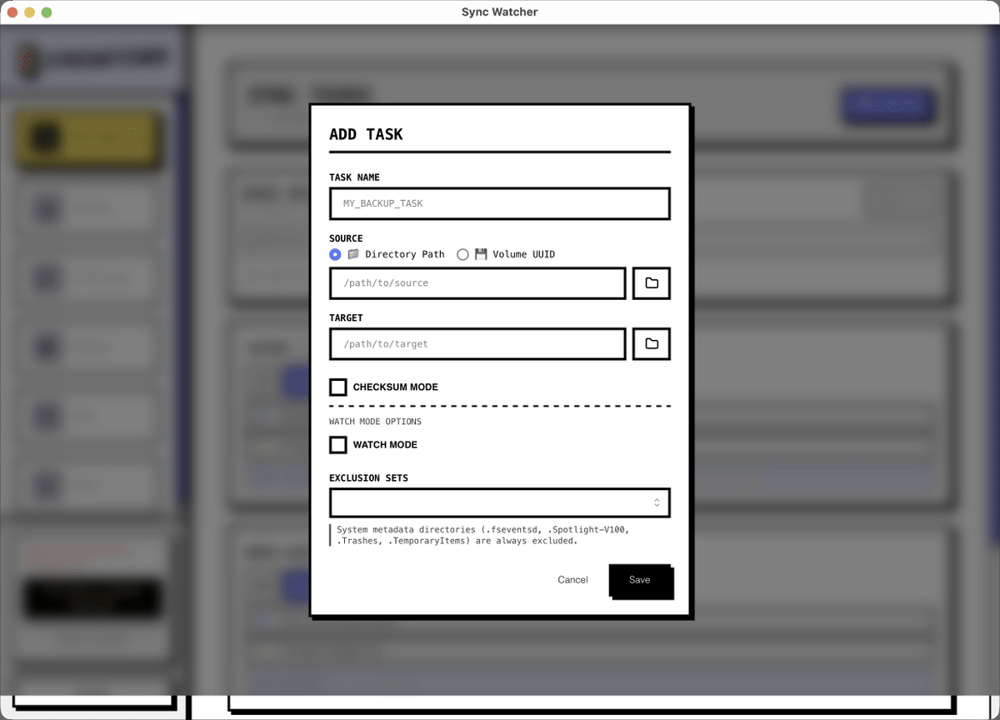

# SyncWatcher

[](./README.md)
[](./README.ko.md)
[](https://github.com/studiojin-dev/SyncWatcher/releases)
[](https://github.com/studiojin-dev/SyncWatcher/releases)

SyncWatcher는 SD 카드, USB 드라이브, 작업 폴더 백업을 반복 수작업이 아닌 안정적인 흐름으로 바꿔주는 macOS 백업 및 단방향 동기화 앱입니다.

이동식 저장장치 감지, 실시간 감시, `dry-run` 안전 확인, 검증 옵션을 하나로 묶어서 파일 복사 작업을 더 빠르고 덜 번거롭게 만듭니다.

## 이런 이유로 사용합니다

- **꽂으면 바로 시작할 수 있음**: 이동식 디스크를 마운트하자마자 감지합니다.
- **반복 작업을 태스크로 저장**: SyncTask를 한 번 만들어 두고 계속 재사용할 수 있습니다.
- **복사 전후를 더 안전하게 확인**: `dry-run`, 체크섬 검증, Target 전용 파일 검토 기능을 제공합니다.
- **백그라운드에서 자동 반응**: `watchmode`로 폴더 변경을 감지해 자동 복사를 이어갑니다.

## 제품 동작 예시

### 메인 대시보드

메인 대시보드에서 작업 상태, 진행 상황, 빠른 실행 버튼을 바로 확인할 수 있어 현재 백업 상태를 쉽게 파악할 수 있습니다.

### SyncTask 만들기



Source와 Target을 고르고, 반복되는 백업 흐름에 맞게 태스크를 저장해 두면 같은 설정을 다시 만들 필요가 없습니다.

### 백업 동작 자동화

이동식 저장장치 대상, 자동 감시, 검증 옵션, 제외 규칙을 조합해서 실제 작업 방식에 맞는 백업 흐름을 구성할 수 있습니다.

자세한 화면별 안내:

- [SyncTask Guide (English)](./docs/synctask.md)
- [SyncTask Guide (Korean)](./docs/synctask.ko.md)
- [MCP Control Guide (English)](./docs/mcp.md)
- [MCP Control Guide (Korean)](./docs/mcp.ko.md)

## 주요 특징

### 백업 흐름

- **단방향 동기화**: Source에서 Target으로 복사
- **Dry-run 모드**: 실행 전 변경 예정 항목 확인
- **체크섬 검증**: 필요할 때만 정확도 중심으로 검증
- **Target 전용 파일 검토**: 정리 전 확인 가능
- **재사용 가능한 SyncTask**: 반복 작업을 태스크로 저장

### 시스템 연동

- **SD 카드와 USB 감지**
- **macOS 마운트 볼륨 모니터링**
- **`notify` 기반 폴더 감시**
- **전체 / 사용 가능 용량 표시**

### 데스크톱 경험

- **Tauri 기반 macOS 앱**
- **빠르게 훑어볼 수 있는 고대비 UI**
- **다크 모드 지원**
- **영어, 한국어, 스페인어, 중국어, 일본어 지원**

## 시작하기

### 요구 사항

- **Rust** 1.70+
- **Node.js** `^20.19.0 || >=22.12.0`
- **pnpm** 10+
- **macOS** 11+

### 개발

```bash
export SYNCWATCHER_LEMON_SQUEEZY_STORE_ID=your_store_id
export SYNCWATCHER_LEMON_SQUEEZY_PRODUCT_ID=your_product_id
# 특정 variant에만 검증을 고정하고 싶을 때만 사용
export SYNCWATCHER_LEMON_SQUEEZY_VARIANT_ID=your_variant_id
export VITE_LEMON_SQUEEZY_CHECKOUT_URL=https://store.studiojin.dev/checkout/buy/f3bcbe48-e9c8-473a-a5fa-64493ac75b97

pnpm install
pnpm dev
pnpm build
pnpm tauri build
# 로컬 서명/노타리제이션 GitHub DMG 릴리스 헬퍼
./scripts/release/local-macos-release.sh
```

### macOS 설치

1. GitHub Releases에서 최신 macOS 릴리스를 다운로드합니다.
2. `.dmg`를 엽니다.
3. `SyncWatcher.app`을 `Applications`로 이동합니다.
4. 앱을 실행합니다.

선택형 후원 구매는 Lemon Squeezy에서 처리하지만, 앱 다운로드와 앱 내 자동업데이트 원본은 계속 GitHub Releases를 사용합니다.

구매 후에는 Lemon Squeezy 영수증 메일과 주문 페이지에서 후원 키를 확인할 수 있습니다. SyncWatcher에서는 사이드바나 Settings의 후원 관리 화면에서 키를 붙여 넣으면 됩니다. 후원 구매는 Apache-2.0 권리를 추가하거나 제한하지 않으며 추가 기능을 잠금 해제하지 않습니다.

### 최신 설치 스크립트

```bash
/bin/bash -c "$(curl -fsSL https://raw.githubusercontent.com/studiojin-dev/SyncWatcher/main/scripts/install-macos-latest.sh)"
```

이 스크립트는 다음을 수행합니다.

1. GitHub 최신 릴리스 태그 확인
2. 현재 아키텍처에 맞는 `aarch64` 또는 `x86_64` DMG 선택
3. DMG와 checksum manifest 다운로드
4. DMG SHA-256 검증
5. `/Applications`에 `Sync Watcher.app` 설치

`curl: (56)` 또는 `404`가 보이면 같은 명령을 다시 실행해서 최신 릴리스 메타데이터 기준으로 다시 다운로드하면 됩니다.

### CLI 미리보기

```bash
cd src-tauri && cargo build --release --bin sync-cli

./src-tauri/target/release/sync-cli \
  --source /Volumes/SD_Card \
  --target ~/Backups/SD \
  --dry-run
```

## 라이선스

SyncWatcher 소스 코드는 [Apache License 2.0](./LICENSE)으로 제공됩니다. Apache-2.0 조건에 따라 상업적 사용, 수정, 재배포, 포크가 허용됩니다.

SyncWatcher 이름, 로고, 앱 아이콘 및 StudioJin 브랜딩은 Apache-2.0 적용 대상이 아닙니다. 수정 배포판은 자체 이름과 앱 아이콘을 사용해야 합니다. 자세한 내용은 [TRADEMARKS.ko.md](./TRADEMARKS.ko.md)와 [BRAND_ASSETS.ko.md](./BRAND_ASSETS.ko.md)를 참고하세요.

[GitHub Releases](https://github.com/studiojin-dev/SyncWatcher/releases)와 Mac App Store는 StudioJin의 공식 배포 채널입니다. 이 표시는 다른 사람이 별도 브랜딩으로 소프트웨어를 빌드하고 재배포할 Apache-2.0 권리를 제한하지 않습니다.

## 피드백과 보안

SyncWatcher는 현재 외부 pull request를 받지 않습니다. 버그 제보와 기능 제안은 [CONTRIBUTING.md](./CONTRIBUTING.md)의 안내에 따라 [GitHub Issues](https://github.com/studiojin-dev/SyncWatcher/issues)를 이용해 주세요. 보안 취약점은 공개 이슈가 아니라 [SECURITY.md](./SECURITY.md)에 안내된 비공개 채널로 제보해 주세요.

## 후원

- 선택형 후원 구매: [Lemon Squeezy checkout](https://store.studiojin.dev/checkout/buy/f3bcbe48-e9c8-473a-a5fa-64493ac75b97)
- 추가 후원: [Buy Me a Coffee](https://buymeacoffee.com/studiojin_dev)
- 지원 이메일: [support@studiojin.dev](mailto:support@studiojin.dev)
- 이용약관: [TERMS.md](https://github.com/studiojin-dev/SyncWatcher/blob/main/TERMS.md)
- 개인정보처리방침: [PRIVACY.md](https://github.com/studiojin-dev/SyncWatcher/blob/main/PRIVACY.md)
- 이용약관(한국어): [TERMS.ko.md](https://github.com/studiojin-dev/SyncWatcher/blob/main/TERMS.ko.md)
- 개인정보처리방침(한국어): [PRIVACY.ko.md](https://github.com/studiojin-dev/SyncWatcher/blob/main/PRIVACY.ko.md)
