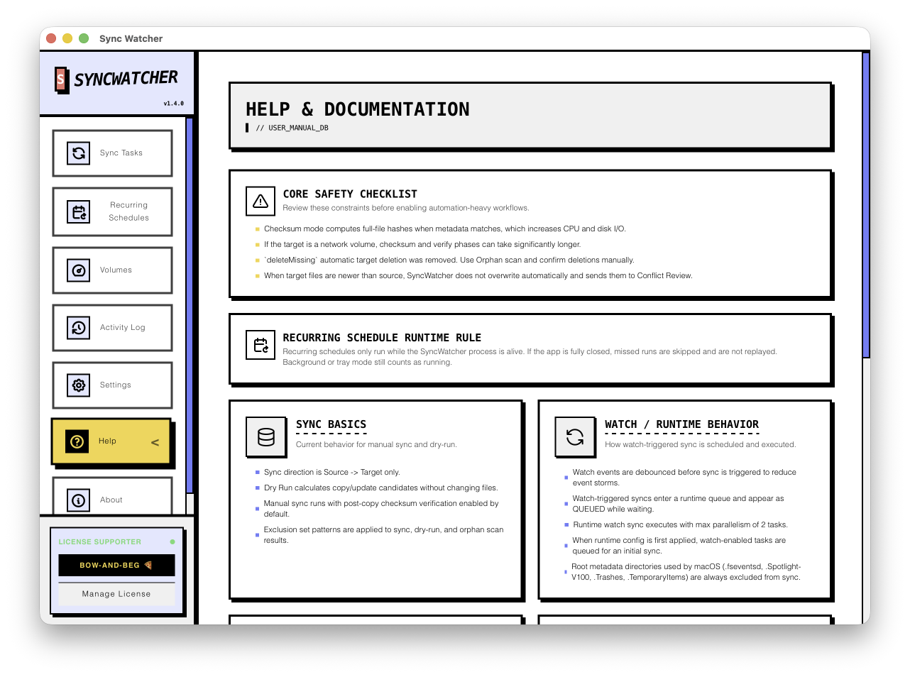
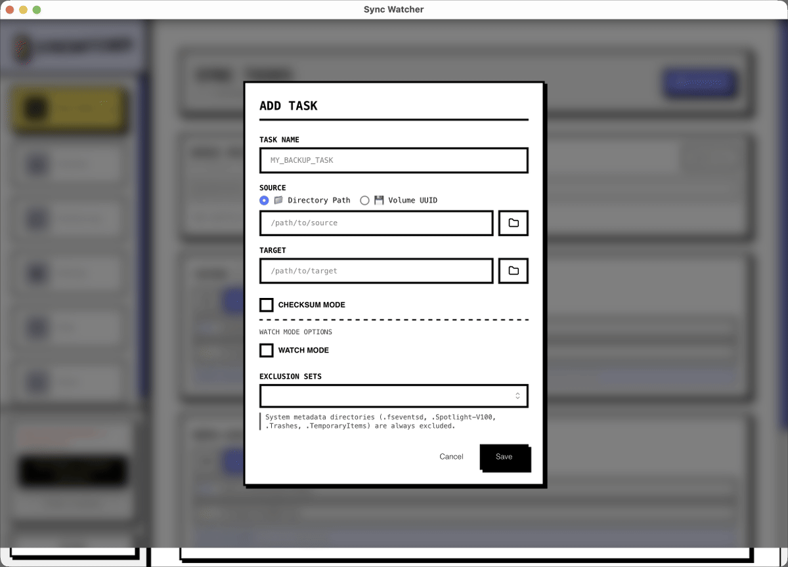
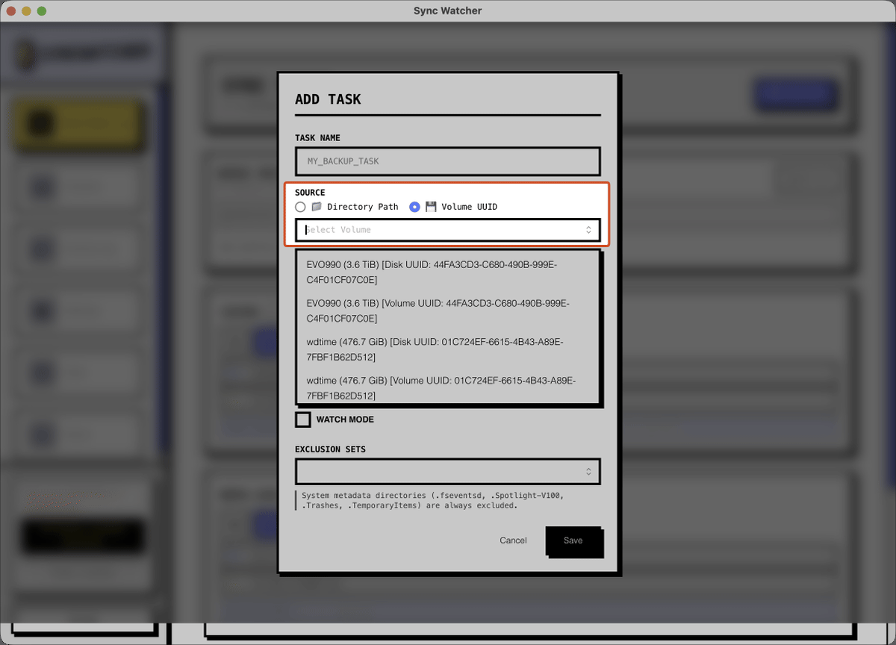

# SyncWatcher (Source-Available)

[](./README.md)
[](./README.ko.md)
[](https://github.com/studiojin-dev/SyncWatcher/releases)
[](https://github.com/studiojin-dev/SyncWatcher/releases/latest)

SyncWatcher keeps SD cards, USB drives, and working folders backed up on macOS without turning every copy job into a manual routine.

It is built for people who move files constantly and want a backup flow that feels native, fast, and predictable.

## Why People Use It

- **Plug in and go**: Detect removable media as soon as it mounts.
- **Turn repeat work into one task**: Save a SyncTask once and reuse it whenever needed.
- **Stay safe before and after copy**: Preview changes with `dry-run`, verify with checksum mode, and inspect target-only files before deletion.
- **Keep folders current automatically**: Let `watchmode` react to file changes in the background.

## Product In Action

### Main Dashboard



The main dashboard keeps task state, progress, and quick actions visible so backup jobs stay easy to understand.

### Create A SyncTask



Choose a Source, pick a Target, and shape the task around your workflow instead of repeating the same copy setup every time.

### Automate Backup Behavior



SyncWatcher supports removable storage targets, automatic watching, verification options, and exclusion rules so the task can match the way you actually work.

Detailed walkthroughs:

- [SyncTask Guide (English)](./docs/synctask.md)
- [SyncTask Guide (Korean)](./docs/synctask.ko.md)

## Feature Highlights

### Backup Workflow

- **One-way sync** from Source to Target
- **Dry-run mode** for previewing changes before execution
- **Checksum validation** with xxHash64 when copy verification matters
- **Target-only file review** before cleanup
- **Reusable SyncTask presets** for recurring jobs

### System Integration

- **SD card and USB detection**
- **Mounted volume monitoring** on macOS
- **Folder watching** powered by `notify`
- **Disk space visibility** for total and available capacity

### Desktop Experience

- **macOS-native app** built with Tauri
- **Bold high-contrast UI** designed for quick scanning
- **Dark mode support**
- **Localized interface** in English, Korean, Spanish, Chinese, and Japanese

## Getting Started

### Requirements

- **Rust** 1.70+
- **Node.js** `^20.19.0 || >=22.12.0`
- **pnpm** 10+
- **macOS** 11+

### Development

```bash
export SYNCWATCHER_LEMON_SQUEEZY_STORE_ID=your_store_id
export SYNCWATCHER_LEMON_SQUEEZY_PRODUCT_ID=your_product_id
# optional when you want to lock validation to a single variant
export SYNCWATCHER_LEMON_SQUEEZY_VARIANT_ID=your_variant_id
export VITE_LEMON_SQUEEZY_CHECKOUT_URL=https://studiojin.lemonsqueezy.com/checkout/buy/1301030

pnpm install
pnpm dev
pnpm build
pnpm tauri build
```

### Install On macOS

1. Download the latest macOS release from GitHub Releases.
2. Open the `.dmg`.
3. Move `SyncWatcher.app` to `Applications`.
4. Launch the app.

Optional license support purchases run through Lemon Squeezy, but app downloads and in-app updates continue to use GitHub Releases.

After purchase, Lemon Squeezy sends the license key by receipt email and exposes it on the customer order page. In SyncWatcher, open the license dialog from the sidebar or Settings and paste the key there.

Depending on your macOS settings, Gatekeeper may show a warning for the DMG.

### Latest Installer Script

```bash
/bin/bash -c "$(curl -fsSL https://raw.githubusercontent.com/studiojin-dev/SyncWatcher/main/scripts/install-macos-latest.sh)"
```

This installer script:

1. Reads the latest GitHub release tag
2. Selects the matching `aarch64` or `x86_64` DMG
3. Downloads the DMG and checksum manifest
4. Verifies the DMG SHA-256
5. Installs `Sync Watcher.app` into `/Applications`

If you see `curl: (56)` or `404`, run the same command again so the latest release metadata is re-resolved before download.

### CLI Preview

```bash
cd src-tauri && cargo build --release --bin sync-cli

./src-tauri/target/release/sync-cli \
  --source /Volumes/SD_Card \
  --target ~/Backups/SD \
  --dry-run
```

## License

This project is **Source-Available** software.

| Component | License |
| --- | --- |
| [Source Code](./LICENSE) | [Polyform Noncommercial 1.0.0](https://polyformproject.org/licenses/noncommercial/1.0.0) |
| Binary Distribution | Proprietary EULA (Free Use, Optional Support License) |

The official app is free to use, including commercial and internal company use. Buying a license is optional and works as project support.

## Support

- License support purchase: [Lemon Squeezy checkout](https://studiojin.lemonsqueezy.com/checkout/buy/1301030)
- Additional tip: [Buy Me a Coffee](https://buymeacoffee.com/studiojin_dev)
