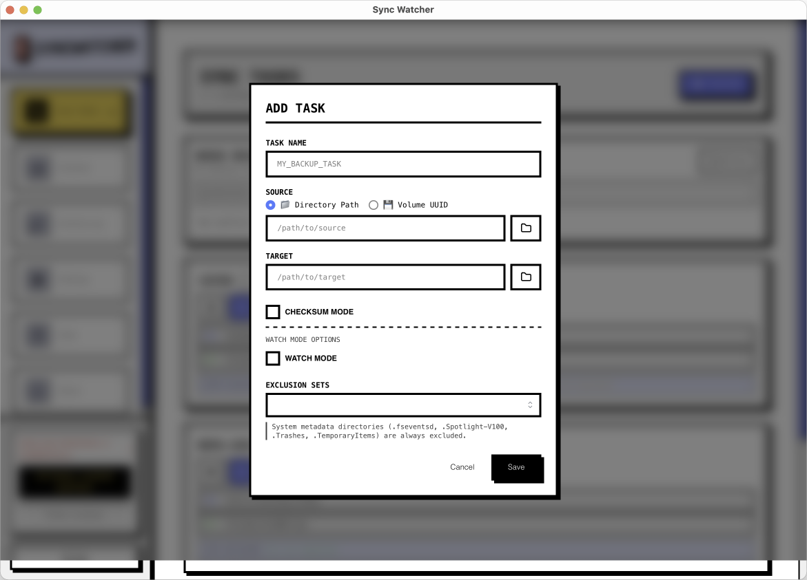
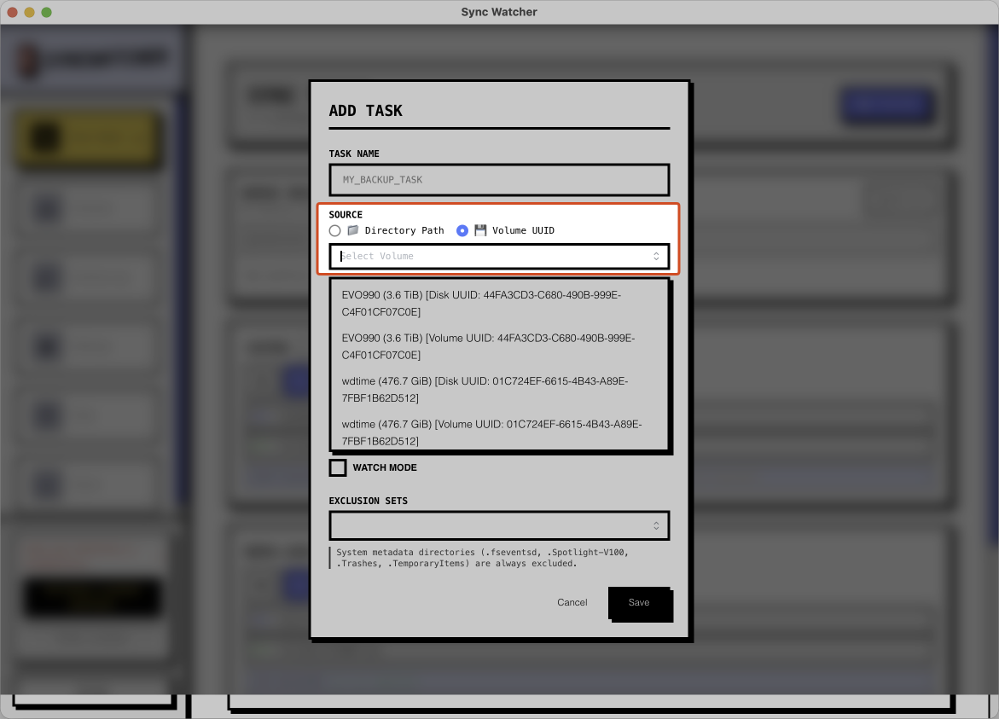
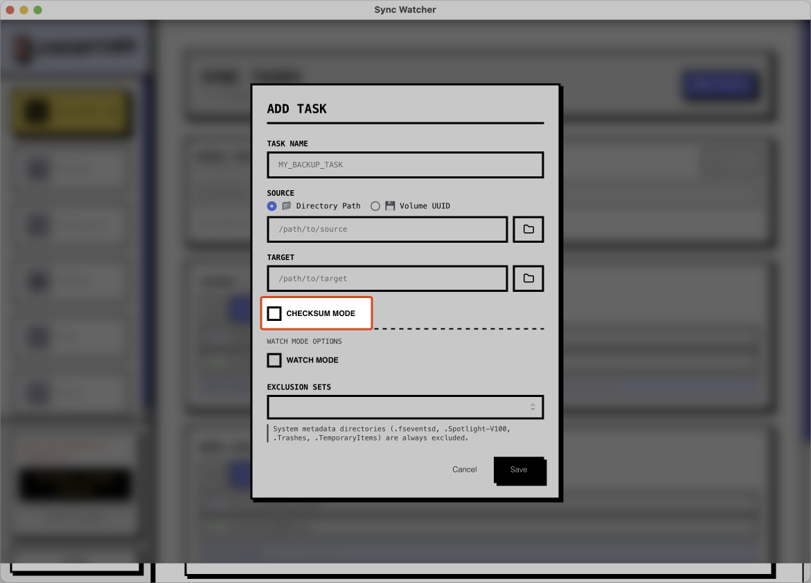
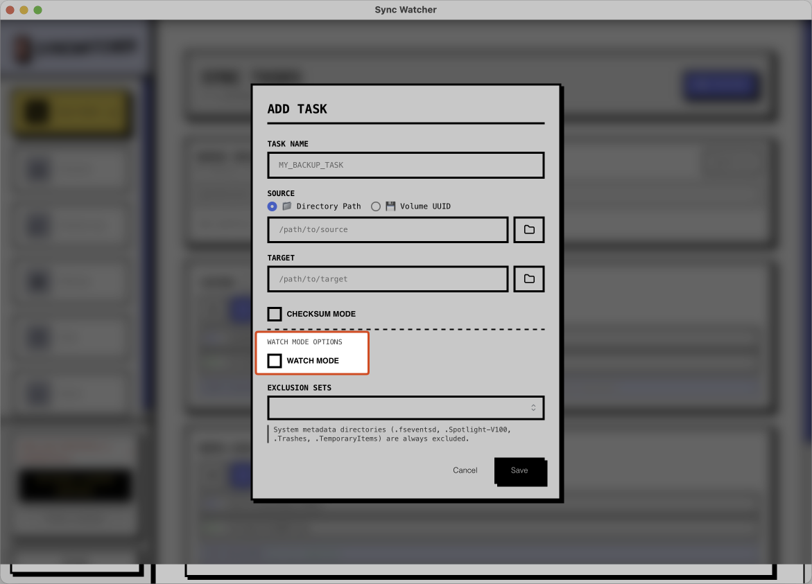
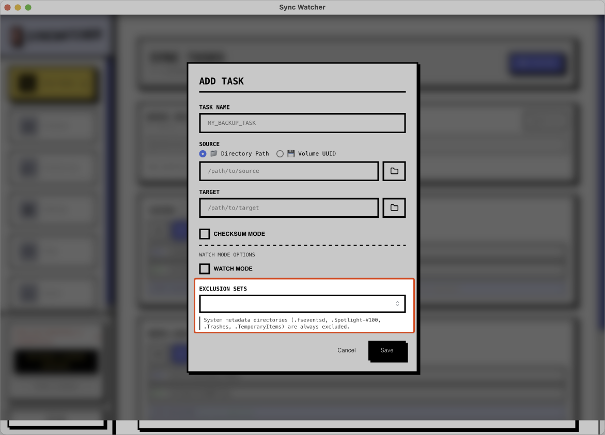
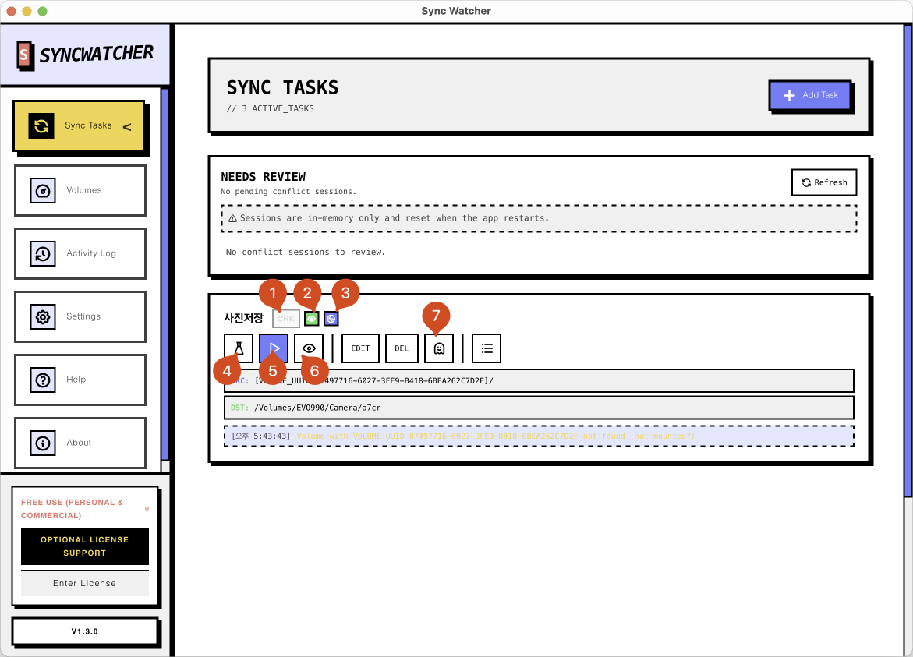

# SyncTask Guide

SyncTask is the reusable backup unit inside SyncWatcher. It stores a Source, a Target, and the options that define how the copy job should behave.

## Dashboard

The dashboard is the first screen users see. It shows task state, progress, and quick controls in one view.

## Add Or Edit A Task

Create a new SyncTask or edit an existing one by choosing the Source, Target, and task options.

The task editor keeps the main controls close together so a recurring workflow can be adjusted quickly.

## Removable Storage Targets

You can choose removable storage such as an SD card as the Target. Combined with `watchmode`, this can also fit workflows that copy automatically and unmount after sync.

## Checksum Mode

Use checksum mode when post-copy verification matters more than speed. After the copy completes, SyncWatcher validates the copied files again.

## Watch Mode

When `watchmode` is enabled, SyncWatcher watches the Source folder and starts a new copy run when files change.

## Excluded File Types

Choose file types that should be excluded from copying. Additional patterns can be added in `Settings`.

## Task Card Controls

1. Checksum mode indicator
2. `watchmode` enabled indicator
3. `autounmount` mode indicator
4. `dry-run` button to preview changes without copying
5. Manual copy button
6. `watchmode` toggle button
7. Deleted-item finder for files present only in Target

After a `dry-run` completes, the result screen can launch `Sync Now` directly from the cached Dry Run result. Manual sync now also shows the pre-copy scan and compare phase so users can see which path is currently being inspected before file copying starts.
